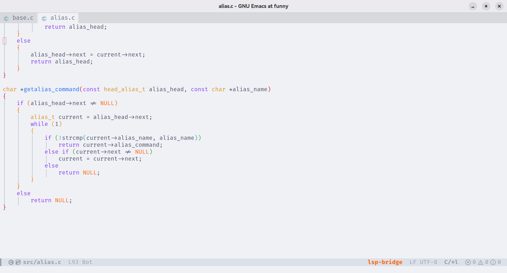

# Warring & Installation
* Only configure for C language(because i only could write program in C),but it may also suitable for Scheme,Shell
* Emacs Version >= 30.1 

* How to use it

  *git clone https://github.com/fcanlnony/my-emacs-configure.git ~/emacs-config && cd ~/emacs.config && chmod +x ./install.sh && ./install.sh*

  *And then start your GNU Emacs: M-x package-refresh-contents RET*
                                                                   
  *Next: M-x package-install-selected-packages RET*

  *Next: M-x all-the-icons-install-fonts RET*

  *Next: M-x nerd-icons-install-fonts RET*

  *Last: M-x fira-code-mode-install-fonts RET*

  *After that,restart your GNU Emacs*

  *Warning: I using Fira Code as my GNU Emacs default fonts.*

  **extensions used ： all-the-icons dashboard highlight-indent-guides treemacs projectile rainbow-delimiters smex use-package markdown-mode beacon awesome-tab corfu corfu-terminal lsp-bridge fira-code-mode doom-modeline nerd-icons**

  **The default applies to the catppuccin, if you need to modify the init.el can be modified.**

* Press F8 to open treemacs, my default setting is to hide hidden files.

* Press F5 to format the code (auto format after save buffer).

* Provides eglot configuration, but uses lsp-bridge by default.

## End
* For lsp-bridge configuration see https://github.com/manateelazycat/lsp-bridge

* For fira-code-mode configuration see https://github.com/jming422/fira-code-mode

## Preview

